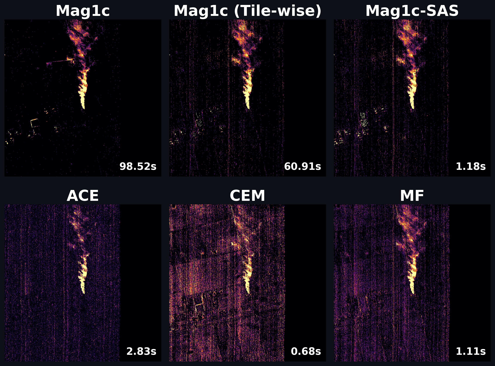

# Methane Filters Benchmark



Welcome to the **Methane Filters Benchmark** repository! This project provides a suite of methane filters designed to benchmark and compare their performance, with a focus on optimizing them for low-power edge devices. In addition to traditional filters we also explore use of machine learning models for filter output refinement.

See the preliminary conference results [here](https://github.com/zaitra/methane-filters-benchmark/tree/033e7769cfdd599d2c77fd7856061788194124ef).

## What's New (Journal Article Update)

- **EMIT deployment on Q8J**: Added the [`emit_deployment/`](emit_deployment/) folder with scripts for preprocessing EMIT data, running the full detection pipeline, and measuring per-step timestamps, resource usage (CPU, RAM, disk I/O), and power consumption on the Q8J board. See [`emit_deployment/README.md`](emit_deployment/README.md) for details.
- **Numpy implementations of Mag1c-SAS**: Added pure-numpy `mag1c_SAS` and `mag1c_tile` implementations in `sped_up_filters.py`.
- **Multiplicative/additive relationship for MF and ACE**: The optimized Matched Filter and ACE now support both multiplicative and additive background-target relationships, controlled via the `addition` parameter (or `USE_MULTIPLICATIVE_RELATIONSHIP` in config). Using the multiplicative relationship improved both visual clarity and detection metrics of these filters.
- **[onboard-methane-detection](https://github.com/zaitra/onboard-methane-detection)**: The Mag1c-SAS preprocessing and inference functions are now in a newly built standalone PyPI library. It wraps the numpy Mag1c-SAS and inference utilities into a simple pipeline, making methane detection a matter of a few function calls. These are needed for the EMIT deployment. Install it with `pip install onboard-methane-detection`.
- **Updated CSVs**: Re-measured runtime of all filters on the Xiphos Q8J and added metrics for the new multiplicative MF and ACE variants. Results in `csvs/`.
- **Code update and refactoring**: Moved hardcoded parameters to YAML configs and CLI arguments across the codebase -- `benchmark/metrics_runner/metrics_runner.py` (configs in `benchmark/metrics_runner/cfg/`), `benchmark/create_filters_for_starcop.py` (`USE_MULTIPLICATIVE_RELATIONSHIP` in `benchmark/cfg/classic.yaml`), and `benchmark/test_sped_up_filters.py` (`--repetitions`, `--no-sleep`, `--channels`, `--measure-morphological-baseline`). Regenerated visualizations in `playbook.ipynb` with the updated data.

## Citation [](https://doi.org/10.48550/arXiv.2606.03675)
If you find our research useful, please cite our article:
```bibtex
@misc{herec2026fastmethanedetectionpipeline,
      title={A Fast Methane Detection Pipeline on Board Satellites Based on Mag1c-SAS and LinkNet}, 
      author={Jonáš Herec and Vít Růžička and Rado Pitoňák and Jan Sedmidubsky},
      year={2026},
      eprint={2606.03675},
      archivePrefix={arXiv},
      primaryClass={cs.CV},
      url={https://arxiv.org/abs/2606.03675}, 
}
```

## Notebook Demos

You can try out our demos directly in Google Colab:

- <a href="https://colab.research.google.com/github/zaitra/methane-filters-benchmark/blob/main/ntbs/Models_demo.ipynb"> Models Demo </a>  
  Demonstrates model inference.

- <a href="https://colab.research.google.com/github/zaitra/methane-filters-benchmark/blob/main/ntbs/Products_demo.ipynb"> Products Creation and Benchmarking Demo </a>  
  Demonstrates generating products and measuring their runtime.

## Resources

- [🤗 STARCOP – All Bands Version](https://huggingface.co/collections/previtus/starcop-67f13cf30def71591f281a41)  
  Raw hyperspectral data, from which the filter products were computed.

- [🤗 Precomputed Filters](https://huggingface.co/datasets/onboard-coop/STARCOP-fast-products)  
  A selection of precomputed spectral filters and data products derived from the STARCOP dataset.

- [🤗 Trained Models](https://huggingface.co/onboard-coop/fast-methane-filters-models)  
  Methane detection models trained using the precomputed products above.

- [🤗 EMIT Test Dataset](https://huggingface.co/datasets/onboard-coop/emit-test-dataset)  
  EMIT hyperspectral test scenes used for evaluation.

## Cloning the Repository

This repository includes submodules. To clone the repository along with all its submodules, use the following command:

```bash
git clone --recursive https://github.com/zaitra/methane-filters-benchmark.git
```

## Overview

The accelerated traditional filters are to be found in file `sped_up_filters.py`, whereas the **Mag1c-SAS**, a modified version of **Mag1c**, is included as a [submodule](https://github.com/zaitra/mag1c) in `benchmark/mag1c_fork`. You can test their runtime using the `test_sped_up_filters.py` script.

**Note**: Make sure to run the commands from the root directory of the methane-filters-benchmark repository. The paths are set to absolute, so you have to include the `benchmark/` prefix when running the `.py` commands.

## Runtime Measurement

To run the tests and benchmark the filters using the provided test tile, use the following command:

```bash
python benchmark/test_sped_up_filters.py --channels [N_of_channels]
```

Each filter is measured over multiple repetitions (default: 100), with a sleep period between measurements to prevent thermal and cache effects from influencing consecutive runs. You can control this behavior with:
- `--repetitions N` to set the number of repetitions per filter (default: 100).
- `--no-sleep` to disable the sleep between measurements (useful for faster debugging runs).
- `--channels 10 25 50 72` to specify which channel counts to benchmark (default: 10 25 35 50 72 90 100 110 125).

Additional options:
- `--compute-original-filters` to also run the original (unoptimized) versions of the filters and compare equivalence.
- `--measure-morphological-baseline` to measure morphological baseline runtime (requires torch and kornia).
- `--precision 32` to set floating point precision (16, 32, or 64; default: 64).
- `--hdr-path <path>` to specify a custom hyperspectral HDR file.

Be sure to run this on the target edge device, as the runtime on your host computer is not representative of edge device performance.

**Note**: The ML models runtime was measured by `benchmark/onnx_inference_time.py` script.

## Filter Generation

To generate the filters from the STARCOP data, use the `benchmark/create_filters_for_starcop.py` script.  
The script supports various tweaks and filter variants, so make sure to set the necessary parameters in the config file located at `benchmark/cfg/classic.yaml`, or create your own custom config.
```bash
python benchmark/create_filters_for_starcop.py --config <path/to/config.yaml>
```

## Assess the Metrics

After creating the products, you can assess the filter metrics using the `benchmark/metrics_runner/metrics_runner.py` script.
Paths, thresholds, and dataset settings are defined in YAML config files located at `benchmark/metrics_runner/cfg/`. Presets are provided for STARCOP, EMIT inference, EMIT Mag1c-SAS, and EMIT original Mag1c.

```bash
python benchmark/metrics_runner/metrics_runner.py --config benchmark/metrics_runner/cfg/starcop.yaml
```

Our results are stored as CSV files inside the `csvs/` directory.