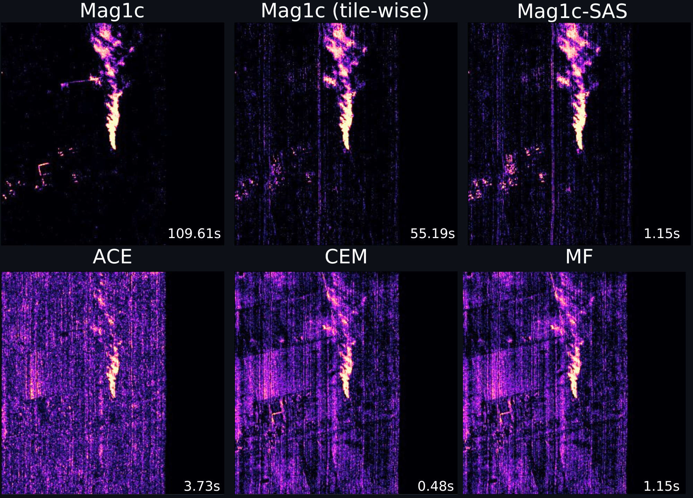

# Methane Filters Benchmark



Welcome to the **Methane Filters Benchmark** repository! This project provides a suite of filters designed to benchmark and compare their performance, with a focus on optimizing them for edge devices.

## Notebook Demos

You can try out our demos directly in Google Colab:

- <a href="https://colab.research.google.com/github/your-org/your-repo/blob/main/ntbs/Models_demo.ipynb"> Models Demo </a>  
  Demonstrates model inference.

- <a href="https://colab.research.google.com/github/your-org/your-repo/blob/main/ntbs/Products_demo.ipynb"> Products Creation and Benchmarking Demo </a>  
  Demonstrates generating products and measuring their runtime.

## Cloning the Repository

This repository includes submodules. To clone the repository along with all its submodules, use the following command:

```bash
git clone --recursive <repository_url>
```

## Overview

This repository includes several filters, with an emphasis on those optimized for faster processing times on edge devices. The file `sped_up_filters.py` contains these optimized filters. You can test their runtime using the `test_sped_up_filters.py` script. Additionally, we incorporate **Mag1c-SAS**, a modified version of **Mag1c**, as a submodule.

**Note**: Make sure to run the commands from the root directory of the methane-filters-benchmark repository. The paths are set to absolute, so you have to include the `benchmark/` prefix when running the `.py` commands.


## Runtime Measurement

To run the tests and benchmark the filters using the provided test tile, use the following command:

```bash
python benchmark/test_sped_up_filters.py --channels [N_of_channels]
```

You can also add the following options:
- `--compute-original-mag1c` to compute the original column-based Mag1c.
- `--compute-original-filters` to also run the original versions of the filters.

**Note**: Be sure to run this on the target edge device, as the runtime on your host computer is not representative of edge device performance.

## Filter Generation

To generate the filters from the STARCOP data, use the `benchmark/create_filters_for_starcop.py` script.  
The script supports various tweaks and filter variants, so make sure to set the necessary parameters in the config file located at `benchmark/cfg/classic.yaml`, or create your own custom config.
```bash
python benchmark/create_filters_for_starcop.py --config <path/to/config.yaml>
```

## Assess the Metrics

After creating the products, you can assess the filter metrics using the `benchmark/metrics_runner/metrics_runner.py` script.  
Paths and threshold values are defined within the script, so ensure they are correctly set for your use case, or use the predefined values we found to perform best.

Our results are stored as CSV files inside the `csvs/` directory.

## Band Selection Strategies

The band selection logic is implemented in the `benchmark/utils.py` file.  
Based on our research, the `"highest-variance"` strategy generally yields the best performance.

To use it, provide a list of wavelengths, a list of CH₄ transmittance values per channel, and the number of channels `N` you want to select.  
You can call the function as follows:

```python
select_the_bands_by_transmittance(wavelengths, ch4_transmittance, N, strategy="highest-variance")
```

The function returns a tuple containing the selected N wavelengths and their corresponding transmittance values, ordered according to the chosen strategy.